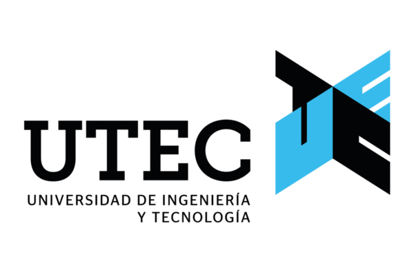
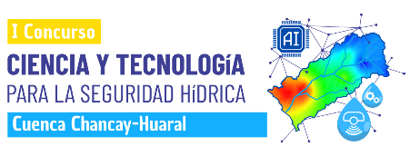
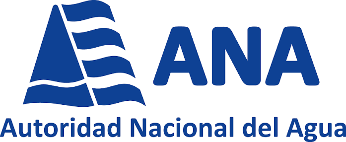
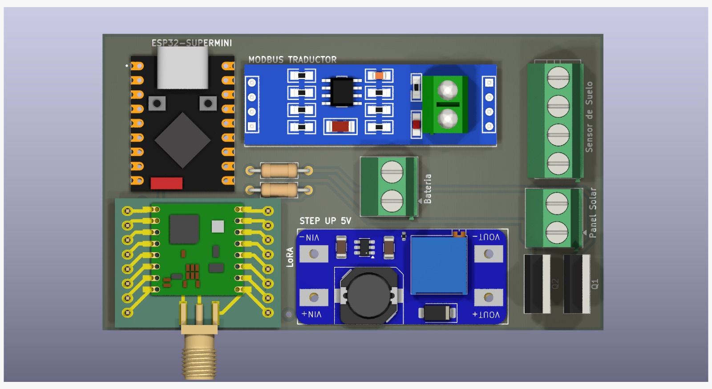
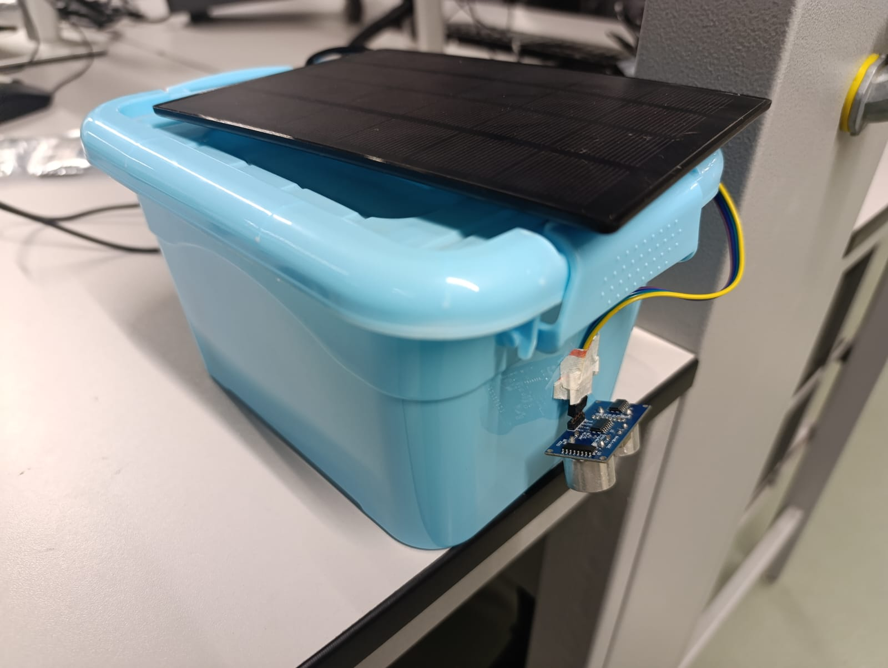

<p align="center">
  
  &nbsp;&nbsp;&nbsp;
  
  &nbsp;&nbsp;&nbsp;
  
</p>

<h1 align="center">HidroAlerta&nbsp;·&nbsp;Chancay-Huaral</h1>

<p align="center">
  <b>Estación IoT + IA de pronóstico de caudal y alerta temprana de crecidas</b><br>
  <i>I Concurso de Ciencia y Tecnología para la Seguridad Hídrica en la Cuenca Chancay-Huaral — ANA 2026</i>
</p>

<p align="center">
  🌊&nbsp;<b><a href="https://luiscontreras73.github.io/hidroalerta-dashboard/">Dashboard interactivo</a></b>
  &nbsp;·&nbsp; 🛰️ IoT + IA &nbsp;·&nbsp; ⏱️ pronóstico 1–14 días &nbsp;·&nbsp; ✅ autoverificado in-situ
</p>

<p align="center">
   
   
   
  
</p>

---

## 🛰️ Qué es

Un sistema que combina un **nodo IoT de campo** (ESP32-SUPERMINI + LoRa, sensores de nivel, temperatura/presión y humedad de suelo, autónomo con panel solar y batería) con un **motor de IA** que pronostica el caudal diario a **1–14 días** con incertidumbre, emite **alerta temprana probabilística** de crecidas y **se verifica in-situ** — el nivel medido cae dentro de la banda que el modelo anunció.

> **No medimos y mostramos: medimos, predecimos y nos autoverificamos.**

## 📊 Resultados (partición de prueba · años nunca vistos)

| Métrica | Valor | Detalle |
|---|---|---|
| **NSE a 14 días** | **0,755** | modelo local TFT canónico + GRU (vs 0,494 del modelo previo) |
| Banda de incertidumbre (CRPS 14 d) | **1,23** | ~4× más ajustada que persistencia (4,57) / climatología (4,45) |
| Alerta de crecida | POD / AUC | dura accionable a **1–3 días**; triage de riesgo a 5–14 días (AUC ≈ 0,87) |

**Arquitectura híbrida:** modelo fundacional zero-shot (Chronos-2) para el nowcast + modelo local para el subestacional, unidos por una compuerta. Validación: split temporal (train ≤2022 · val 2023 · test 2024–25), CRPS, KGE, block-bootstrap, N_eff, calibración (reliability/PIT).

*Limitaciones (declaradas):* los picos extremos se sub-estiman a plazo largo; validación single-basin con pocos eventos (escalado multi-cuenca en curso).

## 🔌 El nodo IoT (hardware propio del equipo)

<p align="center">
  
  &nbsp;
  
</p>

**ESP32-SUPERMINI** · **LoRa RFM96W** (antena SMA) · **BMP280** (temperatura/presión) · sensor de **nivel ultrasónico** · **humedad de suelo** (RS485/Modbus) · **step-up 5V** · **batería 18650** · **panel solar**. Diseño propio en KiCad (esquemas y modelos 3D en [`hardware/`](hardware/)).

## 🗂️ Estructura

| Carpeta | Contenido |
|---|---|
| [`src/`](src/) | Módulos: *features*, *target*, modelos (TFT, GRU, fundacional), utilidades |
| [`scripts/`](scripts/) | Pipeline: `01_bronze` → `02_silver` → `03_gold` → `04_hydro` → `05_models` → `06_eval`; `08_gee` |
| [`configs/`](configs/) | Configuraciones de modelos y experimentos |
| [`data/processed/`](data/processed/) | Datos procesados ligeros (crudos pesados en Drive, ver `FUENTES.md`) |
| [`hardware/`](hardware/) | Nodo IoT: `cad/` (`.step`/`.wrl`) y `kicad/` (esquemas) |

## ▶️ Cómo ejecutar

```bash
pip install -r requirements.txt
# Datos crudos: descargar desde el enlace de FUENTES.md a data/
# Pipeline: ejecutar los scripts en orden 01_bronze → 06_eval
```

## 📚 Datos y fuentes

Datos abiertos: precipitación/temperatura **PISCO** (SENAMHI/IGP), **ERA5-Land** (ECMWF/Copernicus), caudal **ANA/SNIRH**, índices **ENSO** (NOAA), capas de **Google Earth Engine**. Detalle y licencias en [`FUENTES.md`](FUENTES.md).

## 👥 Equipo

- **Luis A. Contreras** — Ing. Ambiental · Deep Learning
- **Diego Mijahuanca** — Ing. Ambiental · análisis de datos
- **Samir Suarez** — Ing. Mecatrónica · nodo IoT
- Asesor: **Ing. Jorge Zafra** — Hidrólogo (UTEC)

Universidad de Ingeniería y Tecnología (**UTEC**), 2026.

## 📄 Licencia

Código bajo licencia **MIT** (ver [`LICENSE`](LICENSE)). Los datos de terceros conservan sus licencias originales.
